# Experiment 3

## Analyzing the Configuration File for a Cisco router

1. ##### Router name:

   gnu-rtrl

2. ##### Ethernet Ports available and of what type (fast-ethernet, gigabit, etc.)

   There's two Ethernet Ports available: FastEthernet0/0 & FastEthernet0/1

3. ##### Configured IP addresses and netmask of ports

     From FastEthernet0/0: 172.16.30.1 255.255.255.0

     From FastEthernet0/1: 172.16.254.45 255.255.255.0

3. Configured routes

```
ip route 0.0.0.0 0.0.0.0 172.16.254.1
ip route 172.16.40.0 255.255.255.0 172.16.30.2
```

##  NAT configuration on the router

1. **Which interface is connected to the Internet?**
      It's *FastEthernet0/1* (ip nat outside).

2. **How many IP addresses are available for *NATing*?**
   255 (mask is 255.255.255.0)
3. **Is the router using overloading or not?**
   Yes.

## DNS configs

2. There aren't any DNS packets, only *icmp*.

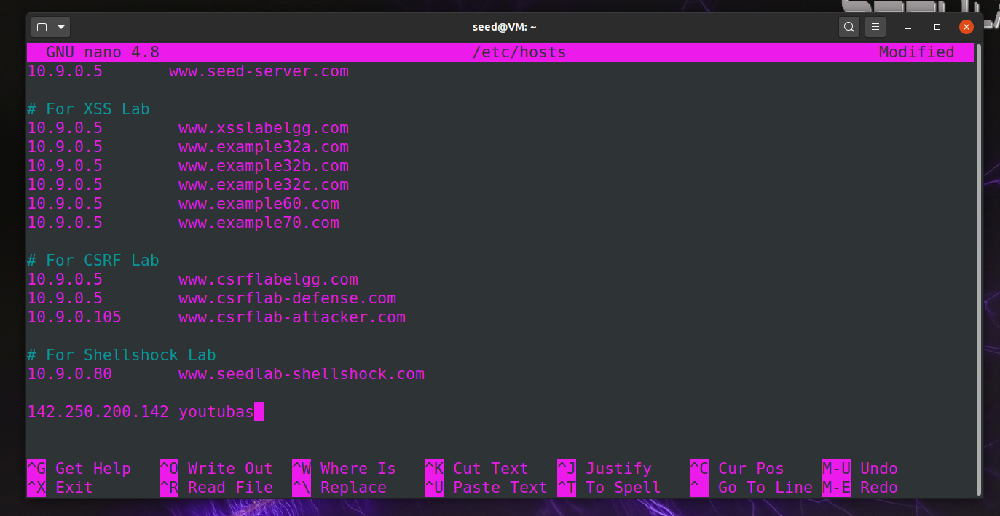

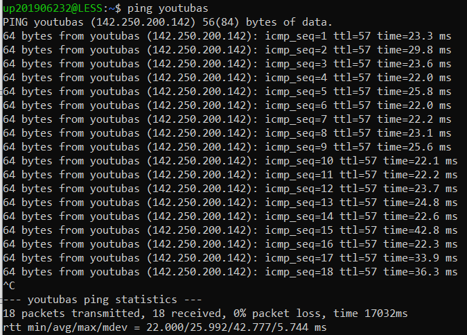

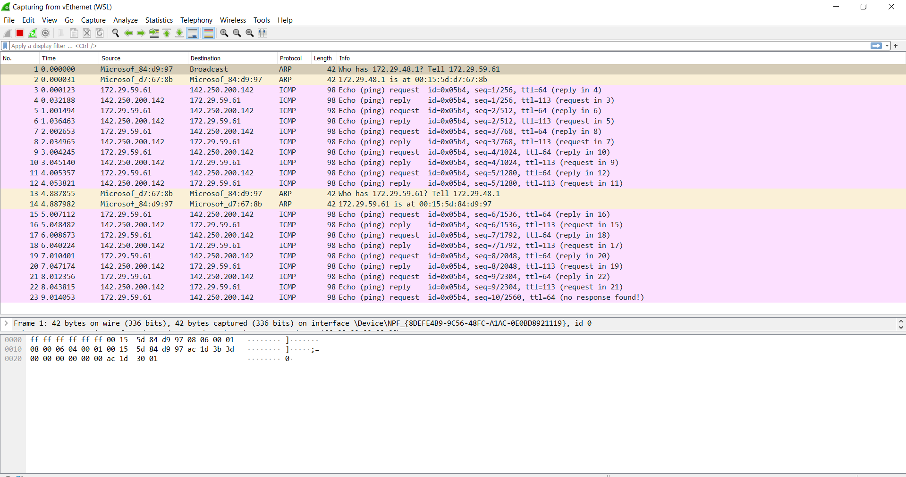

3. The destination address of the DNS query is 10.50.52.1.


4. Destination was 9.9.9.9.

   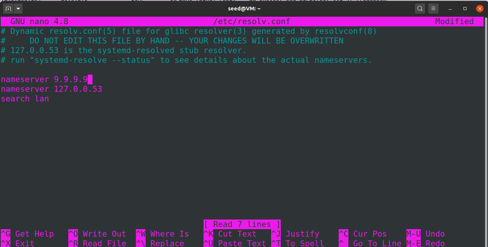

   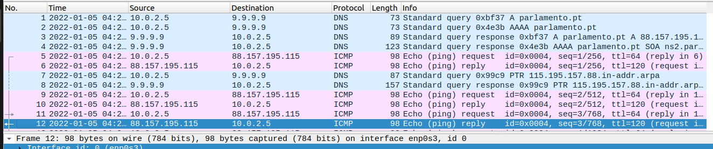

## Linux Routing

1. The default gateway is 10.0.2.1

   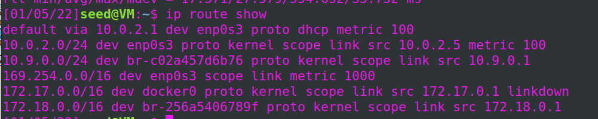

2. Delete the default gateway entry

   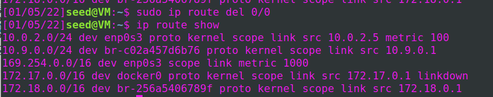

3. As predicted the DNS server is not reachable, as no default route exists 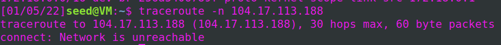

4. Add a specific route for `104.17.113.188` to the gateway found on 1 (10.0.2.1) 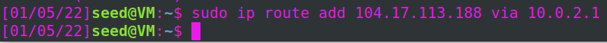

5.  Wireshark logs with traceroute -n 104.17.113.188 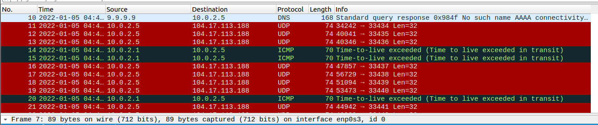

6. Wireshark logs with traceroute -n who.int

   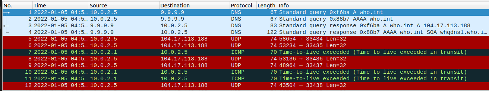

   - 
   - 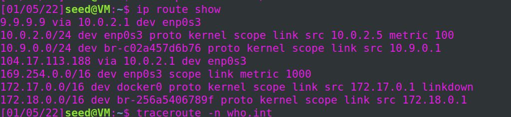
   - 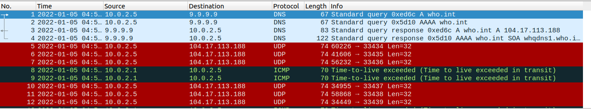

   

7. 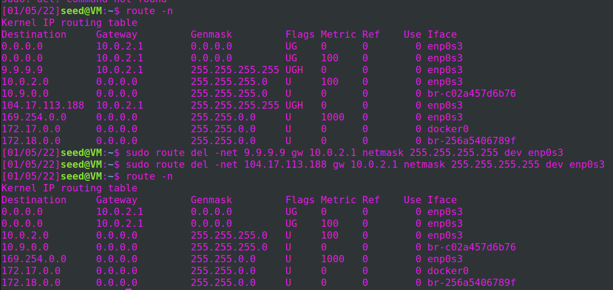


## Questions

1. **(Cisco) How to configure a static route in a commercial router?**

   To configure a static route in a commercial router, we need three values: <u>the IP of the network we are trying to access</u>, <u>its mask</u> and <u>the IP of the port to use as a gateway</u>. That way, the packet, once it arrives to the router, will be redirected to the correct adjacent router.

   

2. **(Cisco) How to configure NAT in a commercial router?**

   1. Configure the router's inside interface using the *ip nat inside* command;

   2. Configure the router's outside interface using the *ip nat outside* command;

   3. Configure an ACL that has a list of the inside source addresses that will be translated;

   4. Configure the pool of global IP addresses using the *ip nat pool NAME FIRST_IP_ADDRESS LAST_IP_ADDRESS netmask SUBNET_MASK* command;

   5. Enable dynamic NAT with the*ip nat inside source list ACL_NUMBER pool NAME global configuration* command.

      

3. **(Cisco) What does NAT do?**

   NAT (Network Address Translation), as its name suggests, is a mechanism implemented in routers that replaces local IP addresses in packets for a public IP address in order to be able to establish a connection outside of the network. This way, the router that implements NAT is responsible for redirecting every packet to the correct address, inside or outside the local network.

   

4. **(DNS) How to configure the DNS service at an host?**

   To configure the DNS, it's necessary to edit the file *"/etc/resolv.conf"* (using sudo), adding the name of the DNS server and a nameserver (for example, **nameserver 9.9.9.9 **), as an IP address.

   

5. **(DNS) What packets are exchanged by DNS and what information is transported?**

   The host sends a packet to the DNS server. This packet has the *hostname* of its intended destination and it will ask the server for the correspondent IP address. After this, the server will send the packet back to host with the correct IP address so the host can communicate with the packet's destination.

   

6. **(Linux) What ICMP packets are observed and why?**

   It's possible to observe request and reply ICMP packets because, during this experiment, several routes were added from where the IPs can reach each other (if we were in the FEUP lab, this would happen with all the tux's).

   

7. **(Linux) What are the IP and MAC addresses associated to ICMP packets and why?**

   Each ICMP packet has the IP and MAC addresses of its origin and destination computer (tux, in the FEUP lab). They are associated to the ICMP packet when the destination computer is reachable (through the command *traceroute*).

   

8. **(Linux) What routes are there in your machine? What are their meaning?**

   **Remote Lab Answer:** We used a Linux VM to do this experiment. Because of this, the several routes that are present in it are due to the fact that in order to have a network connection inside the VM, there needs to exist routing of the main PC's network to it; other routes exist because of the type of applications installed in the VM that are basically some type of VM (for example docker).

   **FEUP Lab Answer**: After the experiment (and before we delete the routes), there are routes that connect every tux to each other. Before, there was a route, representing the connection to the Internet via LAN cable, a route due to *docker*.

